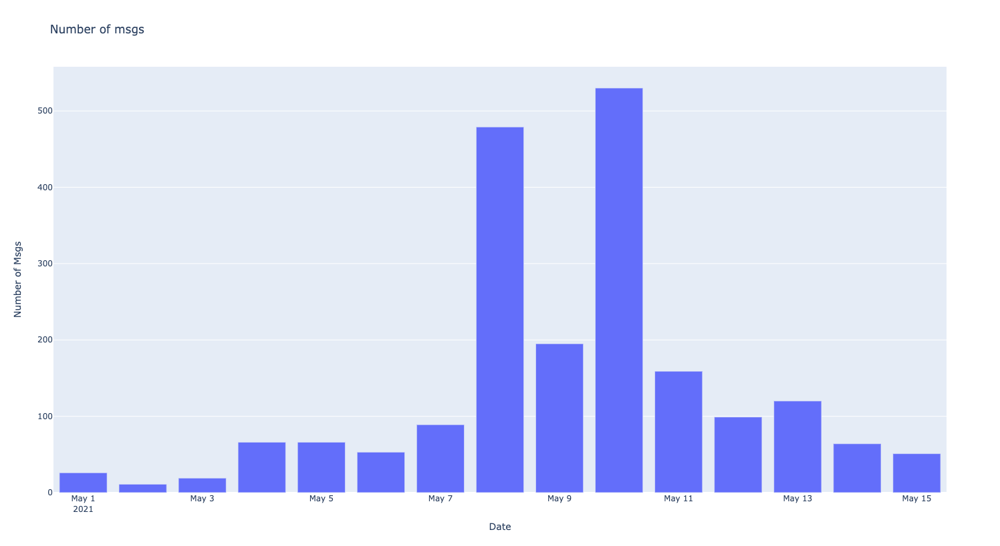
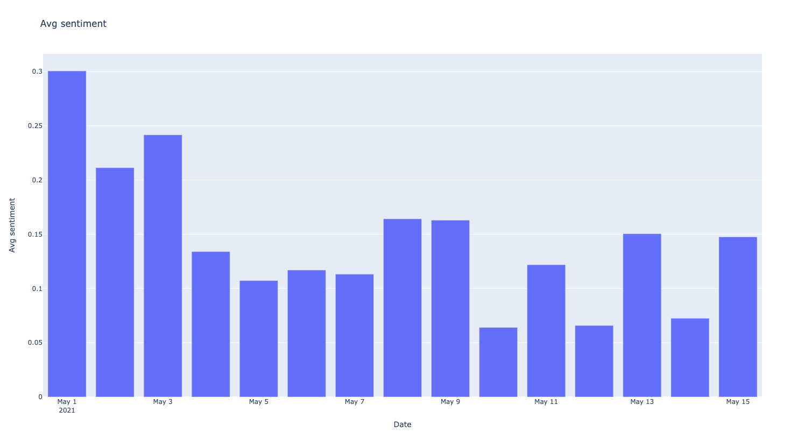

## Sentiment Analyzer

#### To run:

- without plotting a graph: `python analyzer.py`
- with plotting a graph: `python analyzer.py --show`

---

#### Tool used:
- Used Vader sentiment analysis as it is known to understand the sentiment of a text containing emoticons, slangs, conjunctions, capital words, punctuations very well.
- Plotly for plotting number of msgs per day and avg sentiment per day separately into files:
    - 
    - 